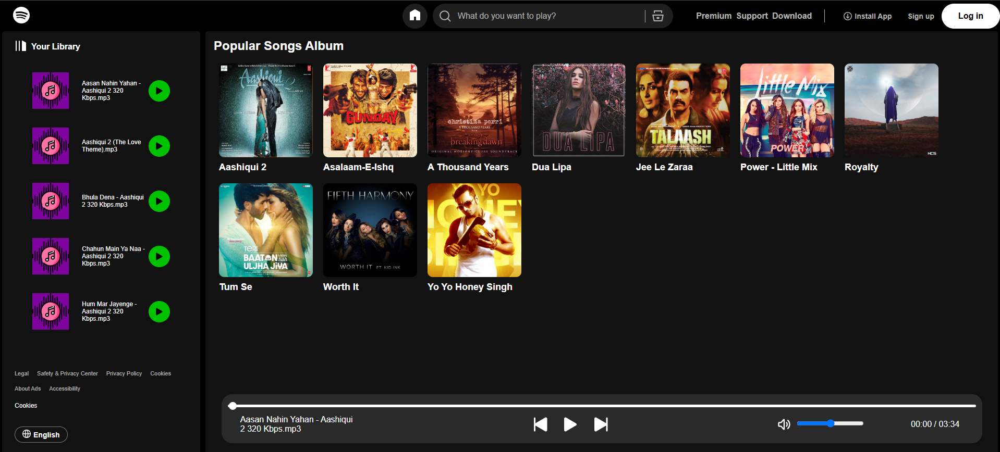
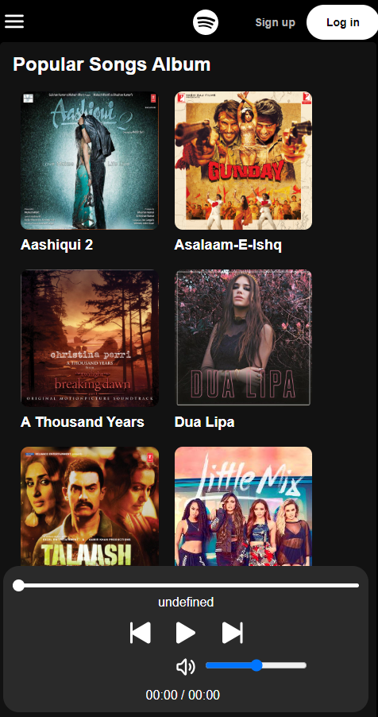
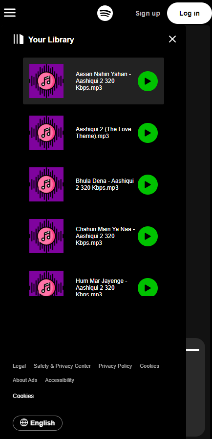

# Responsive Music Player 🎵

A sleek and fully responsive music player web app inspired by the design and functionality of the **Spotify** music website. This project provides an interactive and modern music listening experience with an intuitive user interface.

## Features 🚀

- 🎼 **Play, Pause & Skip Tracks**
- 🎵 **Playlist & Queue**
- 🎚 **Volume Control & Mute Option**
- 📱 **Fully Responsive Design** (Mobile & Desktop Friendly)
- ⚡ **Smooth Animations & Transitions**

## Technologies Used 🛠

- **HTML5, CSS3, JavaScript** (Frontend Development)
- **Flexbox & Grid** (Responsive Layout)
- **FontAwesome Icons** (UI Enhancements)

## Installation & Setup 📦

1. Clone the repository:
   ```sh
   git clone https://github.com/Taha-Lcode/responsive-music-player.git
   ```
2. Navigate to the project folder:
   ```sh
   cd responsive-music-player
   ```
3. Open `index.html` in your preferred browser.

## Screenshots 📸


*Home screen of the music player*



*Responsiveness*

## Inspiration 💡

This project was inspired by **Spotify**'s music player design, aiming to replicate its modern and user-friendly interface while adding custom enhancements.

## Contribution 🤝

Feel free to fork this repository, improve the project, and submit a pull request!

---

Made by **Mohd Taha Saleem**
